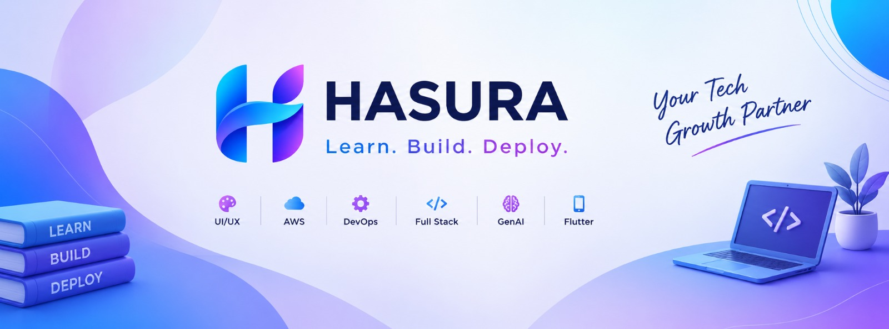

  

# HASURA

### DREAM · BUILD · GROW

**Technology · Design · Development · Creativity**

 

📍 **Rajahmundry, Andhra Pradesh, India**

  

  

 

---

# WE BUILD WHAT'S NEXT.

### Ideas are everywhere.
### Turning them into reality is what we do.

 

<table align="center">
<tr>
<td align="center" width="25%">

### 01

## THINK

Understand the idea.

</td>

<td align="center" width="25%">

### 02

## DESIGN

Shape the experience.

</td>

<td align="center" width="25%">

### 03

## BUILD

Make it real.

</td>

<td align="center" width="25%">

### 04

## GROW

Make it better.

</td>
</tr>
</table>

---

# ✦ NAVIGATION

| | | |
|:---:|:---:|:---:|
| [About](#-about-hasura) | [Services](#-our-services) | [Technology](#-technology) |
| [Process](#-our-process) | [Projects](#-selected-work) | [Clients](#-clients) |
| [Creative](#-creative-studio) | [Team](#-our-team) | [Values](#-our-values) |
| [GitHub](#-github) | [FAQ](#-faq) | [Contact](#-contact) |

---

# ✦ ABOUT HASURA

Hasura is a **technology and creative studio based in Rajahmundry,
Andhra Pradesh, India**.

We combine software engineering, product development, UI/UX,
design and creative services to transform ideas into meaningful
digital experiences.

Our approach brings different disciplines together instead of
treating technology and creativity as separate worlds.

### TECHNOLOGY × DESIGN × CREATIVITY

We work across:

`APPLICATIONS`

`WEBSITES`

`SOFTWARE`

`PROJECTS`

`UI / UX`

`DESIGN`

`VIDEO`

`MUSIC`

`EVENTS`

`CRAFTS`

`DIGITAL EXPERIENCES`

> **We don't just build products.  
> We build experiences around ideas.**

---

# ✦ WHAT MAKES HASURA DIFFERENT?

<table>
<tr>

<td width="25%" align="center">

## 🧠

### THINK

We understand the problem before choosing the solution.

</td>

<td width="25%" align="center">

## 🎨

### DESIGN

We make technology easier and more enjoyable to experience.

</td>

<td width="25%" align="center">

## ⚙️

### ENGINEER

We turn concepts into functional digital products.

</td>

<td width="25%" align="center">

## 🚀

### DELIVER

We focus on practical results, not just ideas.

</td>

</tr>
</table>

---

# ✦ OUR SERVICES

 

<table>
<tr>

<td width="33%" align="center">

# 📱

## APP DEVELOPMENT

We create mobile applications focused on usability,
performance and real-world requirements.

**Mobile UI · APIs · Authentication · Databases · Integrations**

</td>

<td width="33%" align="center">

# 🌐

## WEB DEVELOPMENT

Modern websites and web applications designed for
performance, responsiveness and usability.

**Websites · Dashboards · Portals · Platforms · Web Apps**

</td>

<td width="33%" align="center">

# 💻

## SOFTWARE DEVELOPMENT

Custom software solutions designed around specific
business and project requirements.

**Business Software · Automation · Internal Tools · Platforms**

</td>

</tr>

<tr>

<td width="33%" align="center">

# 🎨

## UI / UX DESIGN

We turn complex requirements into clear,
consistent and user-friendly interfaces.

**Research · Wireframes · Prototypes · Design Systems · UI**

</td>

<td width="33%" align="center">

# 🧩

## PROJECT DEVELOPMENT

From academic concepts to complete working systems,
we help transform requirements into usable products.

**Planning · Development · Documentation · Deployment**

</td>

<td width="33%" align="center">

# ☁️

## CLOUD & DIGITAL

Modern infrastructure and digital solutions designed
to support evolving products.

**Cloud · APIs · Deployment · Automation · Integration**

</td>

</tr>

<tr>

<td width="33%" align="center">

# 🎬

## VIDEO EDITING

Creative video production for events, campaigns,
social media and digital experiences.

**Events · Reels · Promotions · Social Content**

</td>

<td width="33%" align="center">

# 🎵

## MUSIC CREATION

Creative audio and custom music experiences
for projects and events.

**Songs · Audio · Event Music · Creative Content**

</td>

<td width="33%" align="center">

# 🎉

## EVENT SOLUTIONS

Technology and creativity combined for memorable
events and experiences.

**Media · Design · Video · Music · Digital Experiences**

</td>

</tr>

<tr>

<td width="33%" align="center">

# 🎁

## CREATIVE CRAFTS

Creative physical work for events, celebrations
and customized experiences.

</td>

<td width="33%" align="center">

# 📊

## SAP

SAP-oriented technology and project solutions
based on specific requirements.

</td>

<td width="33%" align="center">

# 📈

## SAS

SAS-oriented data and analytics solutions
based on project requirements.

</td>

</tr>
</table>

---

